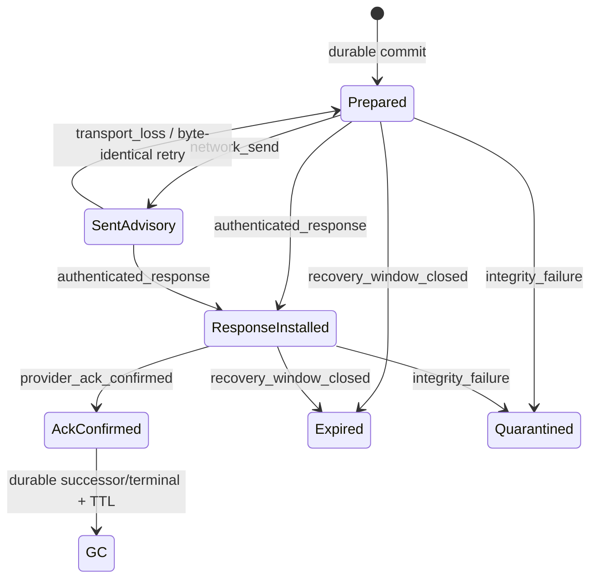

# Host outbox v1 state diagram (non-authoritative)

Generated from `../host-outbox-v1.state-machine.json` SHA-256
`bf9ba9ee5ab22dd537600bc0677950a655a4f0624e2f459715d9e4c06a54e8ef`. Regeneration MUST fail on
input-hash or transition drift.

