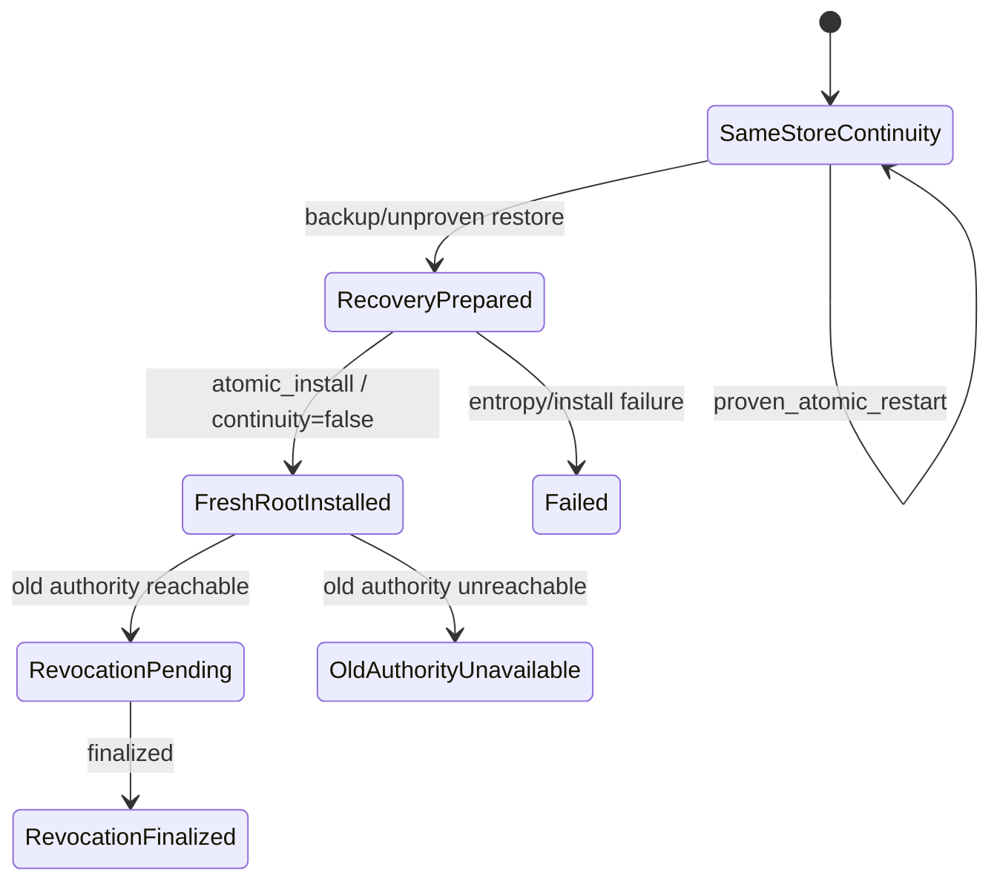

# Identity recovery v2 state diagram (non-authoritative)

Generated from `../identity-recovery-v2.state-machine.json` SHA-256
`910f271d07e86fc1cb75b3c98f304b2809d7fd0dc0f014468f93ad5d2c732c11`. Regeneration MUST fail on
input-hash or transition drift.

