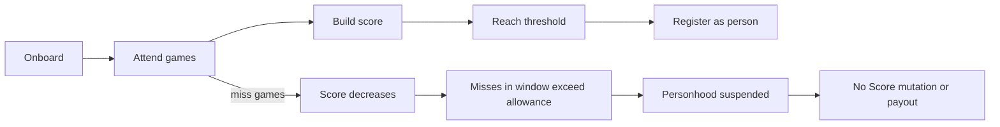
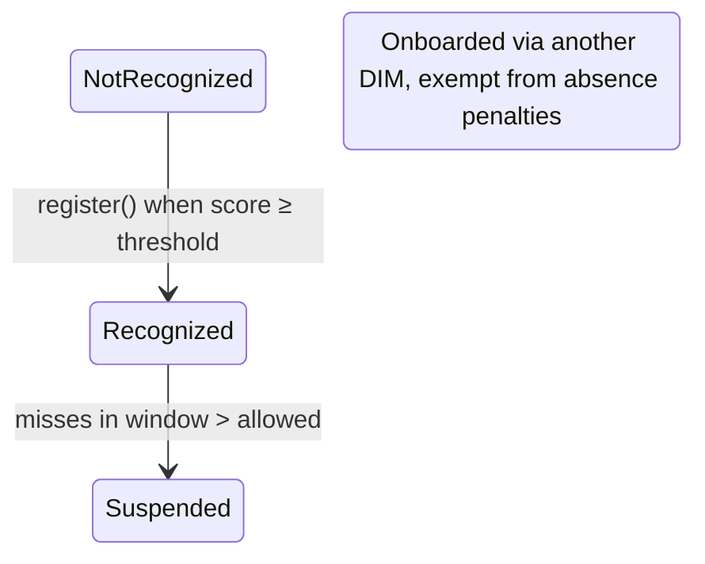

# Score pallet

## Orbis provenance and adaptation

This Apache-2.0 Orbis-owned fork was imported from Individuality Community commit
`28b7d07dab05bbd05f6b664278b5c83841e212d3`. Orbis keeps the upstream storage, calls,
benchmarks, tests and personhood lifecycle, and adapts administration for the enterprise network:
root or the named `ManagerAccount` may perform manager operations, while only root may rotate that
account. The manager is initialized in genesis. Orbis uses native balances and the native
`indiv_pallet_people` interface. No staking, treasury, elections, or public-governance dependency
is introduced. Runtime index 97 and storage version 1 are protocol surfaces.

The `ScoreAsParticipant` extension and the pallet operation boundary both reject unknown accounts
and suspended identities. Suspension is terminal for Score mutation until a separately planned
administrative reinstatement exists: attendance, cash-out and redemption cannot change Score state
or value while suspended.

All payout holds, schedules and redemptions use the named `PayoutAccount` initialized in genesis.
Root may rotate it only when schedules, rounds, points and holds are empty; any remaining free
balance is transferred atomically to the replacement account. Named managers cannot rotate it.

The v0→v1 introduction migration treats the committed pre-Slice-2 representation as an absent
Score storage prefix, installs only the named defaults and storage version, and verifies exact key
counts in try-runtime pre/post checks.

Proof-of-Personhood scoring system that tracks participant attendance and manages personhood
recognition.

Other pallets call `onboard_for_recognition` or `onboard_externally_recognized` to add a
participant to the system, then call `set_attendance` every session to update the score.

Participants can achieve personhood by reaching a score threshold. Before reaching personhood,
they can cash out their score for credit; cashed-out points are converted to credit through
scheduled payout rounds, configured by the named `ManagerAccount` or root. Credit can be redeemed
as a direct transfer.

## Lifecycle

## Scoring

The score increases with consecutive attendance and decreases with consecutive absence. The
change amount equals the current streak/absence length.

**Example 1**

- Game  1: ✅ +1 =>  1
- Game  2: ✅ +2 =>  3
- Game  3: ✅ +3 =>  6
- Game  4: ✅ +4 => 10
- Game  5: ✅ +5 => 15
- Game  6: ✅ +6 => 21  ← personhood reached, score capped at MAX_PERSONHOOD_THRESHOLD
- Game  7: ✅    => 21
- Game  8: ❌ -1 => 20
- Game  9: ❌ -2 => 18
- Game 10: ❌ -3 => 15
- Game 11: ✅ +1 => 16
- Game 12: ✅ +2 => 18

**Example 2**

- Game 1: ✅ +1 => 1
- Game 2: ✅ +2 => 3
- Game 3: ✅ +3 => 6
- Game 4: ✅ +4 => 10
- Game 5: ✅ +5 => 15
- Game 6: ❌ -1 => 14
- Game 7: ✅ +1 => 15
- Game 8: ✅ +2 => 17
- Game 9: ✅ +3 => 20
- Game 10: ❌ -1 => 19
- Game 11: ❌ -2 => 17
- Game 12: ❌ -3 => 14
- Game 13: ❌ -4 => 10
- Game 14: ❌ -5 => 5
- Game 15: ❌ -6 => 0

When reaching the personhood threshold, the participant is recognized as a person and the
score is capped at `MAX_PERSONHOOD_THRESHOLD` (21). Example:

- Game 1: ✅ +1 => 1
- Game 2: ✅ +2 => 3
- Game 3: ✅ +3 => 6
- Game 4: ✅ +4 => 10
- Game 5: ✅ +5 => 15
- Game 6: ✅ +6 => 21 : personhood reached
- Game 7: ✅ +7 => 21
- Game 8: ✅ +8 => 21
- Game 9: ✅ +9 => 21

### Personhood threshold

The score required for personhood scales dynamically with the number of active people,
updated at the start of each attendance report session:

| Active people   | Threshold |
|-----------------|-----------|
| 0 – 5,000       | 1         |
| 5,001 – 10,000  | 3         |
| 10,001 – 20,000 | 6         |
| 20,001 – 35,000 | 10        |
| 35,001 – 50,000 | 15        |
| 50,001+         | 21        |

### Absence grace period

The absence grace period is the permitted number of misses within a rolling window of
recent games. It is defined as a ratio `(allowed_misses, window)`. For example, `(1, 6)`
means that 1 miss is tolerated within the last 6 games; a 2nd miss in that window triggers
suspension. If `allowed_misses` is 0, any single absence immediately suspends
personhood. The tolerance tightens as the network grows:

| Active people    | Allowed misses | Window |
|------------------|----------------|--------|
| 0 – 5,000        | 5              | 6      |
| 5,001 – 10,000   | 4              | 5      |
| 10,001 – 20,000  | 3              | 4      |
| 20,001 – 35,000  | 2              | 3      |
| 35,001 – 50,000  | 1              | 2      |
| 50,001+          | 1              | 6      |

These defaults can be overridden at runtime via the `AbsenceGraceSchedule` storage item.

`AbsenceGraceRatio` functions similar to a cache: it stores the currently active
allowed-misses/window ratio derived from the schedule. `update_thresholds()`
refreshes it at the start of every report session based on the current
population size.

Attendance history is tracked per participant as a rolling bitfield of the last 8 games.
Externally recognised persons are exempt from absence penalties and are never suspended.

### Recognition states

A participant's recognition status follows this state machine:

## Extrinsics

| Call | Origin | Context | Description |
|------|--------|---------|-------------|
| `schedule_payout_rounds` | named manager / root | Payout scheduling | Schedule future payout rounds, holding funds from the pot account |
| `remove_payout_schedule` | named manager / root | Payout scheduling | Remove a scheduled payout round and release held funds |
| `transition_round` | Unsigned (task) | Payout lifecycle | Finish the current round (moving it to payout) and plan the next one |
| `operate_payout_round` | Unsigned (task) | Payout lifecycle | Drain a round's participants up to a limit, distributing credit |
| `cash_out` | Signed / participant | Income | Trade half your score (rounded up) for payout points; only before reaching personhood, once per game session |
| `redeem_credit` | Person / signed / participant | Income | Transfer accumulated credit to a destination account |
| `register` | Signed / participant | Personhood | Register as a person (with key + proof), or resume after suspension |
| `set_absence_grace_schedule` | named manager / root | Configuration | Override the default grace tiers for absence (max 8 tiers, sorted by population threshold, window ≤ 8) |

## Income

### Cash out

Participants who have **never** reached personhood can cash out their score for points.
The amount is half of their score, rounded up. A participant can only cash out once per game session.
The points accumulate in the current payout round and are converted to credit when the round
transitions to payout.

## Rounds and payout

Round transition is managed by the task `transition_round`. Participants accumulate points for
the current round when attending and completing games, but the current round is not always
planned — it may not yet have an expiration or credit amount.

`transition_round` plans the current round when a schedule exists. When the current round is
planned and its expiration is reached, it transitions to a payout round, and a new round begins
(planned immediately if another schedule exists).

The payout round is operated with the task `operate_payout_round`, which converts all points in
the round to credit. When the process finishes, the payout round is deleted.

## Account participant origin

**Warning**: The pallet provides a new origin [`Origin::AccountParticipant`]. This origin
**must** be restricted by some other extensions such as in `indiv-pallet-origin-restriction` to
prevent spam. It is recommended to use `indiv-pallet-origin-restriction`.

When onboarding as an account-based participant, a sufficient reference is added to the account,
allowing use of the transaction extension [`ScoreAsParticipant`] to transmute a signed origin
into an account participant origin. When offboarding, the sufficient reference is removed.
